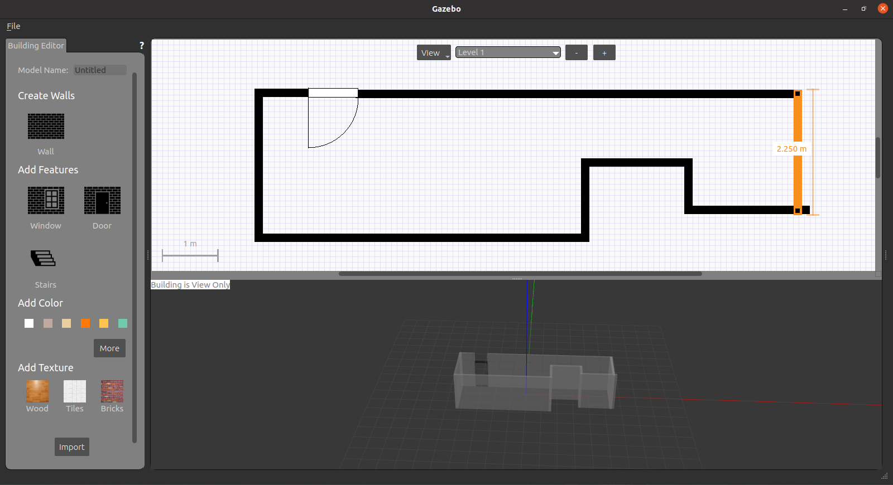

<head>
    <script src="https://cdn.mathjax.org/mathjax/latest/MathJax.js?config=TeX-AMS-MML_HTMLorMML" type="text/javascript"></script>
    <script type="text/x-mathjax-config">
        MathJax.Hub.Config({
            tex2jax: {
            skipTags: ['script', 'noscript', 'style', 'textarea', 'pre'],
            inlineMath: [['$','$']]
            }
        });
    </script>
</head>

# 素材整理

## 论文检索

1. 绪

   

2. 高级检索

   

3. 出版物检索

   

## 记录一下

### 2月23日

1. 成果展示：

   

2. python中numpy数组的使用

   | 操作 | 示例                         | 备注                          |
   | :--: | ---------------------------- | ----------------------------- |
   |  加  | `vec = np.c_[vec, temp]`     |                               |
   |  减  | `vec = np.delete(vec, 0, 0)` | 还得多试试，有点不理解        |
   | 降维 | `hull = np.squeeze(hull)`    | 去除多维数组中，维度为1的维度 |

   ```python
   img = cv2.imread('/home/kiana/Code/openCV_learning/img/people.png', -1)	# 这儿带入参数-1，不然默认读取还是三通道
   h = img.shape[0]  # 高度
   w = img.shape[1]  # 宽度
   
   # 这儿把所有点丢进去，因为没法找到图片
   vec = np.array([0, 0])
   for row in range(h):
       for col in range(w):
           if img[col, row] == 255:
               temp = np.array([row, col])  # 注意这儿数组与图像坐标是反过来的？
               vec = np.c_[vec, temp]
   vec = np.transpose(vec)  # 转置一下
   vec = np.delete(vec, 0, 0)  # 获取轮廓点集合
   ```

3. 凸包算法

   ```python
   # 寻找凸包
   hull = cv2.convexHull(vec)
   hull = np.squeeze(hull)  # 去除多维数组中，维度为1的维度
   print(hull)
   ```

   ```python
   #绘制凸包（轮廓）
   length = len(hull)
   for i in range(len(hull)-1):
       # cv2.circle(img, (hull[i][1], hull[i][0]), radius=1, color=255, thickness=2)
       cv2.line(img, hull[i], hull[i+1], color=255, thickness=2)
   ```

4. 椭圆拟合

   ```python
   ellipse = cv2.fitEllipse(hull)
   [(x, y), (a, b), angle] = cv2.fitEllipse(hull)
   img = cv2.ellipse(img, ellipse, 255, 2)
   print("中心坐标：%f,%f", x, y)
   print("长轴：%f；短轴%f", a, b)
   print("旋转角度：%f", angle)
   cv2.circle(img, (round(x), round(y)), radius=1, color=255, thickness=2)
   ```

5. 坐标系？

   数组保存与opencv图像像素坐标系好像不一致，有点迷糊

6. 。。


### 2月24日

阅读中感悟人生
买的文竹到了!


### 2月25日

1. 四元数

   1. 四元素与欧拉角转换

      ```cpp
      struct Quaternion
      {
          double w, x, y, z;
      };
       
      Quaternion ToQuaternion(double yaw, double pitch, double roll) // yaw (Z), pitch (Y), roll (X)
      {
          // Abbreviations for the various angular functions
          double cy = cos(yaw * 0.5);
          double sy = sin(yaw * 0.5);
          double cp = cos(pitch * 0.5);
          double sp = sin(pitch * 0.5);
          double cr = cos(roll * 0.5);
          double sr = sin(roll * 0.5);
       
          Quaternion q;
          q.w = cy * cp * cr + sy * sp * sr;
          q.x = cy * cp * sr - sy * sp * cr;
          q.y = sy * cp * sr + cy * sp * cr;
          q.z = sy * cp * cr - cy * sp * sr;
       
          return q;
      }
      ```

   2. 利用tf转化

      ```cpp
      tf2::Quaternion quaternion_tf2;
      quaternion_tf2.setRPY(roll, pitch, yaw);
      geometry_msgs::Quaternion quaternion = tf2::toMsg(quaternion_tf2);
      ```

      ```cpp
      geometry_msgs::Quaternion quaternion_from_rpy(double roll, double pitch, double yaw)
      {
        tf2::Quaternion quaternion_tf2;
        quaternion_tf2.setRPY(roll, pitch, yaw);
        geometry_msgs::Quaternion quaternion = tf2::toMsg(quaternion_tf2);
        return quaternion;
      }
      ```
      
      [不太支持简单方式](https://answers.ros.org/question/365102/efficient-way-to-convert-from-roll-pitch-yaw-to-geometry_msgsquaternion/)
   
### 2月26日

1. [多传感器同步](https://www.codeleading.com/article/97095608754/)

   ```cpp
   #include <message_filters/subscriber.h>
   #include <message_filters/time_synchronizer.h>
   #include <sensor_msgs/Image.h>
   #include <sensor_msgs/CameraInfo.h>
   
   using namespace sensor_msgs;
   using namespace message_filters;
   
   void callback(const ImageConstPtr& image, const CameraInfoConstPtr& cam_info)
   {
     // Solve all of perception here...
   }
   
   int main(int argc, char** argv)
   {
     ros::init(argc, argv, "vision_node");
   
     ros::NodeHandle nh;
   
     message_filters::Subscriber<Image> image_sub(nh, "image", 1);
     message_filters::Subscriber<CameraInfo> info_sub(nh, "camera_info", 1);
     TimeSynchronizer<Image, CameraInfo> sync(image_sub, info_sub, 10);
     sync.registerCallback(boost::bind(&callback, _1, _2));
   
     ros::spin();
   
     return 0;
   }
   
   ```

   注意修改find_package配置：

   ```yaml
   find_package(catkin REQUIRED COMPONENTS
     roscpp
     rospy
     std_msgs
     message_filters
   )
   ```
   奇怪是必须先启动摄像头才能订阅到，中断摄像头再重启后无法进入

2. [rosparam](https://blog.csdn.net/qq_39779233/article/details/108411778)

   ```
   launch文件使用：
   <rosparam file="$(find euclidean_cluster)/param.yaml" command="load"/>
   ```

   ```
   ros中读取参数
   ros::param::get("/background_r", red);
   ```

   ```
   保存当前参数
   rosparam dump file_name
   ```

3. [marker](http://wiki.ros.org/rviz/Tutorials/Markers%3A%20Points%20and%20Lines)
   
   注意POINTS、LINE_STRIP、**LINE_LIST** 三类在**连接处**区别
   
   ```
   The POINTS type places a point at each point added. The LINE_STRIP type uses each point as a vertex in a connected set of lines, where point 0 is connected to point 1, 1 to 2, 2 to 3, etc. The LINE_LIST type creates unconnected lines out of each pair of points, i.e. point 0 to 1, 2 to 3, etc.
   ```

   [LINE_STRIP](https://blog.csdn.net/Fang_cheng_/article/details/116454690)

   我用LINE_LIST，下方编号0-3，上方对应4-7

4. 正则化替换
   

### 2月27日

1. 动态参数
   
   [wiki](http://wiki.ros.org/dynamic_reconfigure/Tutorials)

   [古月居](https://zhuanlan.zhihu.com/p/39899955)

   注意include时'#include "dynamic_parameter/TutorialsConfig.h"'一个是功能包名,后面是cfg名+Config

2. 总结
   
   1. 使用yaml文件导入参数

      ```
      launch文件使用：
      <rosparam file="$(find euclidean_cluster)/param.yaml" command="load"/>
      ```

      ```
      ros中读取参数
      ros::param::get("/background_r", red);
      ```

      ```
      保存当前参数
      rosparam dump file_name
      ```

   2. 使用动态参数

### 2月28日

   Machine Learning

### 3月5日

   开会+划水

### 3月6日

   莫名其妙的bug竟是我忘记展开？
   重装ROS

### 3月7日

   1. vscode之markdown
   
      1. 插件-markdown shortcut
      
      2. 修改快捷方式
      
         1. F1调出vscode命令行
             
            
         2. 修改json文件
            
            ```
            {
               "key": "ctrl+shift+oem_2",
               "command": "editor.action.blockComment",
               "when": "editorTextFocus && !editorReadonly"
            },
            {
               "key": "shift+alt+a",
               "command": "-editor.action.blockComment",
               "when": "editorTextFocus && !editorReadonly"
            },
            {
               "key": "ctrl+shift+k",
               "command": "md-shortcut.toggleCodeBlock",
               "when": "editorTextFocus && markdownShortcuts:enabled"
            },
            {
               "key": "ctrl+shift+oem_4",
               "command": "md-shortcut.toggleBullets",
               "when": "editorTextFocus && markdownShortcuts:enabled"
            },
            {
               "key": "ctrl+shift+oem_6",
               "command": "md-shortcut.toggleNumbers",
               "when": "editorTextFocus && markdownShortcuts:enabled"
            },
            {
               "key": "ctrl+shift+t",
               "command": "md-shortcut.toggleCheckboxes",
               "when": "editorTextFocus && markdownShortcuts:enabled"
            }
            ```
      3. 行内公式
         
         $(y_1-1)$

      4. 代码高亮

         | 语言 | 写作 |
         | ------ | ------ |
         | Python | python |
         | c++    | cpp    |
         | c#     | csharp |

      5. [图片批注](https://blog.csdn.net/szzheng/article/details/104563358)      

      <center>
         
         <br>
         <div style="color:orange; border-bottom: 1px solid #d9d9d9;
         display: inline-block;
         color: #999;
         padding: 2px;">
            在这里插入图片注释
         </div>
      </center>
           
   2. [占据栅格地图](https://www.guyuehome.com/34184)
   
   3. ROS中栅格地图——nav_msgs::OccupancyGrid

      ```
      myMap.info.width = 10;
      myMap.info.height = 20;
      
      for (std::size_t i = 0; i < myMap.info.width * myMap.info.height; i++)
      {
         int8_t a;
         if(i==2||i==11||i==20||i==9)
         {a=200;}
         else
         {a = 1;}
         myMap.data.push_back(a);
      }
      ```

   

   最小一行从左到右 0~9
   
   1. 点云向指定平面投影
      
      ```cpp
      #include <pcl/point_types.h>
      #include <pcl/ModelCoefficients.h>
      #include <pcl/filters/project_inliers.h>
      
      pcl::ModelCoefficients::Ptr coefficients(new pcl::ModelCoefficients());
      coefficients->values.push_back(0.0);
      coefficients->values.push_back(0.0);
      coefficients->values.push_back(1.0);
      coefficients->values.push_back(0.0);

      pcl::ProjectInliers<pcl::PointXYZ> proj;
      proj.setInputCloud(in);
      proj.setModelCoefficients(coefficients);
      proj.setModelType(pcl::SACMODEL_PLANE);
      proj.filter(*out);   
      ```
   
   2. 消息类型转换
      
      ```
      #include <pcl_conversions/pcl_conversions.h>   

      pcl::fromROSMsg(*in_cloud_ptr, *current_3D_ptr); 
      ```   

   3. 栅格怎么划分呢

### 3月8日

   1. 点云坐标~像素坐标

      ```cpp
      cv::Size smallSize;
      smallSize.height = 100;
      smallSize.width = 100;
      cv::Mat Image = cv::Mat(smallSize, CV_8U, Scalar(0)); // 创建单通道黑色图像。

      //定义一个1m*1m的区域，每一个栅格1cm*1cm，共100*100
      float x0 = minPt.x, y0 = minPt.y;

      for (int count = 0; count < base_filtered_ptr->points.size(); count++) //从第一个点云开始遍历所有的点云数量。
      {
         int x = round((base_filtered_ptr->points[count].x - x0) / 0.01);
         int y = round((base_filtered_ptr->points[count].y - y0) / 0.01);
         std::cout << "x: " << x << " "
               << "y:" << y << std::endl;
         Image.at<uchar>(y, x) = 255;
      }
      cv::imwrite("people.png", Image);    
      ```

   2. 栅格坐标~OccupancyGrid坐标
         

         自定义：栅格坐标**从1开始**

         假设栅格坐标为（3，1），则OccupancyGrid坐标为2

         假设栅格坐标（$x_栅, y_栅$）,则OccupancyGrid坐标为$(y_栅-1)*width_x + x_栅 - 1$

   3. 点云坐标~栅格坐标

         $x_栅 = round(x/grid)+1$

         $y_栅 = round(y/grid)+1$
      
   4. 效果

         

      ```cpp
      int p[myMap.info.width * myMap.info.height] = {-1}; // [0,100]

      for (int count = 0; count < in->points.size(); count++)
      {
         int x_grid = round((in->points[count].x - map_x0) / grid_size) + 1;
         int y_grid = round((in->points[count].y - map_y0) / grid_size) + 1;

         int grid = (y_grid - 1) * width_x + x_grid - 1;
         p[grid]=100;
      }

      std::vector<signed char> a(p, p + width_x*width_y);
      myMap.data = a;

      // frame id
      myMap.header.frame_id = "velodyne";
      // 广播
      pub_grid_.publish(myMap);      
      ```

   5. [Gmapping源码详解](https://www.cnblogs.com/xgth/p/13991651.html)
      
      不想学习

### 3月9日

   1. SLAM综述视频，半懂不懂

   2. 教五广场樱花 + 古琴 YYDS

### 3月10日

   1. 学了一点ML

   2. Gmapping实验
         
      出现bug，动态障碍物看上去**没有影响建图**，但是定义起点到终点间为可通行区域时错误将**近距离障碍物**消除掉了，有点离谱

      

   3. [交换空间不足](https://blog.csdn.net/weixin_44796670/article/details/121234446)
   
      [根治](https://blog.csdn.net/qq_41813208/article/details/103391153)

      catkin_make时报错：fatal error: Killed signal terminated program cc1plus

      我是原本有2G交换空间太小被迫扩容，[此方案无用](https://zhuanlan.zhihu.com/p/140961253)

   4. [将三维点云转化为二维LaserScan](https://blog.csdn.net/weixin_44926598/article/details/116597743)

      1. 地面区域误识别为障碍

      

      

      1. 后面障碍物被前面挡住

         每个角度只能选取一个最小的距离值

         ```cpp
         // overwrite range at laserscan ray if new range is smaller
         int index = (angle - scan_msg->angle_min) / scan_msg->angle_increment;
         if (range < scan_msg->ranges[index]) {
         scan_msg->ranges[index] = range;
         }
         ```
         
   5. A-LOAM实验

      

      中间明显将行人错误加入建图中了啊啊啊

   6. ╮(╯▽╰)╭ 

### 3月11日

   1. 点云重新排序？之前极坐标栅格方式？


   2. 去除障碍再建图
   3. Tag的使用
   4. 。。

### 3月12日

   1. 离群点滤波好慢，，，大致0.07S，然后应该是聚类慢

   2. 拼图快乐，下次还想去

### 3月13日

   1. 预备队培训略尴尬（2048确实蛮好玩）

   2. 第一次训练，酸爽
      
### 3月14日

   1. 躺平

   2. 柳暗花明学完ML课程. 感谢时区差异,我还有机会

   3. 尝试Gazebo仿真

### 3月15日

   1. Gazebo
      
      `rosrun gazebo_ros gazebo`

      

      

      Edit -->Building Editor

      

   2. 烦躁安装

      sudo apt-get install ros-noetic-navigation

      报错：
      
      [nNo link elements found in urdf file](https://blog.csdn.net/weixin_44203358/article/details/109004622?spm=1001.2101.3001.6661.1&utm_medium=distribute.pc_relevant_t0.none-task-blog-2%7Edefault%7ECTRLIST%7ERate-1.pc_relevant_default&depth_1-utm_source=distribute.pc_relevant_t0.none-task-blog-2%7Edefault%7ECTRLIST%7ERate-1.pc_relevant_default&utm_relevant_index=1)

      [解决gazebo第一次启动长时间黑屏、等待问题](https://blog.csdn.net/FLORIDA_tang/article/details/100120185?spm=1001.2101.3001.6661.1&utm_medium=distribute.pc_relevant_t0.none-task-blog-2%7Edefault%7ECTRLIST%7ERate-1.pc_relevant_paycolumn_v3&depth_1-utm_source=distribute.pc_relevant_t0.none-task-blog-2%7Edefault%7ECTRLIST%7ERate-1.pc_relevant_paycolumn_v3&utm_relevant_index=1)

   3. 。

### 3月16日

   1. 学习urdf结构，实现小车+传感器

   2. URDF常用命令：

      ```
      安装
      sudo apt-get install liburdfdom-tools    

      检查文件
      check_urdf mrobot_chasis.urdf

      查看模型整体结构
      urdf_to_graphiz mrobot_chasis.urdf
      ```

   3. xaro常用命令

      ```
      xacro转为URDF
      rosrun xacro xacro.py mrobot.urdf.xacro > mrobot.urdf
      ```

### 3月17日

   1. 实现rviz+gazebo仿真
      
      

      

   2. vscode
      1. [实现 ctrl + 鼠标滑轮对显示界面放大与缩小](https://www.php.cn/tool/vscode/440264.html)
         
         
      2. 用户界面缩放

         界面放大：Ctrl + =

         界面缩小：Ctrl + -

         界面复位：Ctrl + NumPad0
      
   3. [Ubuntu16.04安装sogou输入法](https://blog.csdn.net/weixin_44205779/article/details/107464267)


### 3月18日

   写论文，水图片

### 3月19日

   水论文

### 3月20日

   1. 雷达畸变

		如果是扫描频率5Hz的激光雷达，一帧数据的首尾时间差200ms，若机器人以0.5m/s的速度向x方向走扫描前面的墙面，那么200ms后尾部的测量距离和首部的测量距离在x方向上相差10cm，如下图所示：

		

		原理：在一帧激光雷达数据中，为每个激光束的原点都找到一个近似的里程计位姿，并且认为该激光束是在该里程计位姿上进行数据采集的，得到这些基础数据之后，进行系列的坐标变换，**把所有激光点的数据都变换到第一束激光原点的坐标系下**，然后再封装数据，这样就能极大的减小畸变。
		
   2. ITF永远的倒数

### 3月21日

   书好好看，火锅好好吃

   锅圈食汇火锅食材超市，番茄锅一绝

### 3月22日

   1. 错过《儒林外史》，火鸡面到啦
   
   2. [上交RM雷达开源](https://bbs.robomaster.com/forum.php?mod=viewthread&tid=12239)

		我们与他们还不一样，他们雷达可以固定在场外一直扫描，我们的得安在机器人上，也说不上谁好谁坏？
   
   3. livox 雷达——基于非重复式扫描设计
    
		非重复扫描类似视网膜的中央凹，其点云的中心角密度最大，该特点可以用于类似通过移动眼睛、集中注意力观察的应用。相比于传统激光雷达，这种非重复扫描的方法可以提供更高的分辨率，这非常有利于机器人的应用比如传感器标定

		其中LiDAR一直是保持静止状态的，时间越长，点云密度越高，对场景的还原度越好。传统的多线机械式LiDAR静止时的点云密度无法通过时间累积来提升。

		
		
		

   4. [Ubuntu开机自启](https://www.codenong.com/cs106456571/)

      [sh文件](https://www.cnblogs.com/carle-09/p/12582209.html)

      1. ros+launch文件

         新建launch_auto.sh文件

         ```
         #!/bin/bash
 
         source /opt/ros/noetic/setup.sh    #声明系统环境
         source /home/kiana/catkin_ws/devel/setup.bash     #声明所在的工作空间
         
         roslaunch euclidean_cluster euclidean_cluster.launch      #运行launch文件脚本内容
         
         exit 0       
         ```     
         
         修改启动应用程序首选项

         因为sh文件没有预先调用终端，使用如下命令(M)：`gnome-terminal -x /home/kiana/文档/launch_auto.sh`
         
         

      2. python文件

         hello.py：
         ```python
         #!/home/kiana/anaconda3/envs/spider/bin/python
         # -*- coding: utf-8 -*-

         print("Hello,Kiana")
         import time
         import requests

         weekDays = ("星期一","星期二","星期三","星期四","星期五","星期六","星期日")
         idx = time.localtime().tm_wday
         print(time.strftime("今天是%Y年%m月%d日", time.localtime()),weekDays[idx],"\n")

         url = 'https://v2.jinrishici.com/one.json'
         r = requests.get(url)  # 响应API
         # 返回内容为json格式文件
         # 将API响应存储在一个变量中
         # json()函数仅解码json格式返回
         response_dict = r.json()
         # 处理结果  获得响应字典
         print(response_dict['data']['content'])      
         ```

         ```bash
         #!/bin/bash
         gnome-terminal -- bash -c "cd /home/kiana/文档/auto_startup;./hello.py; sleep 8"
         wait
         exit 0         
         ```

         启动项管理直接浏览选定sh文件即可
         注意因为存在输出，必须要sleep延迟显示 
         
         `gnome-terminal --  bash -c "/home/kiana/文档/auto_startup/test.sh;sleep 5"`

### 3月23日
  
   1. [点云上色](https://blog.csdn.net/luolaihua2018/article/details/120400879)

        参考PCL源码程序 05随机采样一致性

        对于ptr数据类型，点云相加可以
        `*cluster_array += *cluster`

        

        

      ```cpp
      pcl::visualization::PCLVisualizer::Ptr simpleVis(pcl::PointCloud<pcl::PointXYZ>::ConstPtr cloud, pcl::PointCloud<pcl::PointXYZ>::ConstPtr final = nullptr) {
         // --------------------------------------------
         // -----Open 3D viewer and add point cloud-----
         // --------------------------------------------
         pcl::visualization::PCLVisualizer::Ptr viewer(new pcl::visualization::PCLVisualizer("3D Viewer"));
         viewer->setBackgroundColor(0, 0, 0);
         viewer->addPointCloud<pcl::PointXYZ>(cloud, "sample cloud");
         viewer->setPointCloudRenderingProperties(pcl::visualization::PCL_VISUALIZER_POINT_SIZE, 2, "sample cloud");

         if (final != nullptr) {
            pcl::visualization::PointCloudColorHandlerCustom<pcl::PointXYZ> color_handler(final, 255, 0, 0);
            viewer->addPointCloud<pcl::PointXYZ>(final, color_handler, "final cloud");
            viewer->setPointCloudRenderingProperties(pcl::visualization::PCL_VISUALIZER_POINT_SIZE, 4, "final cloud");
         }

         viewer->addCoordinateSystem (1.0, "global");
         viewer->initCameraParameters();
         return (viewer);
      }        

      ```
   2. Fast Segmentation of 3D Point Clouds for Ground Vehicles
    
        [GIT代码](https://github.com/lorenwel/linefit_ground_segmentation)

        [论文详解](https://blog.csdn.net/lovelyaiq/article/details/118826534)

        [AdamShan](https://adamshan.blog.csdn.net/article/details/84569000?spm=1001.2101.3001.6650.1&utm_medium=distribute.pc_relevant.none-task-blog-2%7Edefault%7ECTRLIST%7ERate-1.pc_relevant_antiscanv2&depth_1-utm_source=distribute.pc_relevant.none-task-blog-2%7Edefault%7ECTRLIST%7ERate-1.pc_relevant_antiscanv2&utm_relevant_index=2)


### 3月26日

1. gitee图床挂了，离谱

2. vscode中图片使用相对路径

    

    使用替换：

    'https://gitee.com/Kiana-yx/pictures/raw/master/' 转为`../img-post/`


### 3月27日

《小妇人》电影

主教操场音乐节+二食堂烧烤

### 3月28日

厚德奖学金白跑一趟，但梅园食堂确实好吃

油泼面确实有点油

1. 阿里云

   

   

2. Navigation Stack


上图中位于导航功能正中心的是move_base节点，可以理解为一个强大的路径规划器，在实际的导航任务中，你只需要启动这一个node，并且给他提供数据，就可以规划出路径和速度。 move_base之所以能做到路径规划，是因为它包含了很多的插件，像图中的白色圆圈global_planner（全局路径规划）、local_planner（局部路径规划）、global_costmap（全局的代价图）、local_costmap（局部的代价图）、recovery_behaviors（恢复行为）。而每一个插件其实也都是一个package，放在Navigation Stack里。

| 种类   | 特点 |
| -------- | ----- |
| 单目相机 | 平移之后才能计算深度，无法确定真实尺度 |
| 双目相机 | 通过两相机之间距离来估计每个像素的空间位，**计算量** |
| 深度相机 | 通过红外结构光或ToF原理，主动向物体发射光并接收返回的光，测出物体离相机的距离 |

### 3月29日
1. SLAM

   

   在视觉 SLAM 中，前端和计算机视觉研究领域更为相关，比如图像的特征提取与匹配等，后端则主要是滤波与非线性优化算法

   * 传感器信息读取。在视觉 SLAM 中主要为相机图像信息的读取和预处理。如果在机器人中，还可能有码盘、惯性传感器等信息的读取和同步。
   * 视觉里程计 (Visual Odometry, VO)。视觉里程计任务是估算相邻图像间相机的运动，以及局部地图的样子。VO 又称为前端（Front End）。**累计漂移**
   * 后端优化（Optimization）。后端接受不同时刻视觉里程计测量的相机位姿，以及回环检测的信息，对它们进行优化，得到全局一致的轨迹和地图。由于接在 VO 之后，又称为后端（Back End）。
   * 回环检测（Loop Closing）。回环检测判断机器人是否曾经到达过先前的位置。如果检测到回环，它会把信息提供给后端进行处理。
   * 建图（Mapping）。它根据估计的轨迹，建立与任务要求对应的地图

   运动方程：$x_k=f(x_{k-1},u_k,w_k)$

   $u_k$是运动传感器的读数，$w_k$为噪声

   观测方程：$z_{k,j}=h(y_j,x_k,v_{k,j})$

   在$x_k$位置上看到某个路标点$y_j$，产生了一个观测数据$z_{k,j}$

   当我们知道运动测量的读数 u，以及传感器的读数 z 时，如何求解定位问题（估计 x ）和建图问题（估计 y ）？这时，我们把 SLAM
   问题建模成了一个状态估计问题：如何通过带有噪声的测量数据，估计内部的、隐藏着的状态变量

2. kdevelop使用
   
   sudo apt-get install kdevelop

3. [CMakeLists使用](https://blog.csdn.net/cliukai/article/details/90670243)

   ```
   方法一：详见《视觉SLAM十四讲》P30
   # 共享库
   add_library( hello_shared SHARED libHelloSLAM.cpp )

   add_executable( useHello useHello.cpp )
   # 将库文件链接到可执行程序上
   target_link_libraries( useHello hello_shared )

   方法二：直接多文件编译？
   add_executable( useHello useHello.cpp libHelloSLAM.cpp )   
   ```

### 3月30日

1. [特征值与特征向量](https://www.bilibili.com/video/BV1Ls411b7oL?spm_id_from=333.337.search-card.all.click)

2. Hip hop街舞公开课

   认识一位教研院研究生小姐姐，一起听雨声，穿过樱花大道，见见神秘蝶楼，好棒！

### 3月31日

   [latax加粗](https://blog.csdn.net/yhl_leo/article/details/50997822)

1. 旋转向量与旋转矩阵

   旋转向量：方向与旋转轴一致，长度等于旋转角的向量

   旋转矩阵：3 * 3表示旋转，4 * 4表示旋转+平移

   **罗德里格斯公式：旋转向量->旋转矩阵**

   

   **旋转矩阵->旋转向量** 
   
   **旋转轴经过旋转之后不变**
   

2. 欧拉角

   “偏航-俯仰-滚转”（yaw-pitch-roll）

   

   优点：直观

   缺点：万向锁（Gimbal Lock）

   

   理论上可以证明，只要我们想用三个实数来表达三维旋转时，都会不可避免地碰到**奇异性**问题。
   
   由于这个原理，欧拉角**不适于插值和迭代**，往往**只用于人机交互**中。

3. 四元数

   $\pmb{q}=q_0+q_1i+q_2j+q_3k$

   
   
   绕单位向量$\pmb{n}=[n_x,n_y,n_z]^T$进行角度为$\theta$的旋转

   

   显然$\theta+2\pi$后，四元数值变为$-\pmb{q}$。四元数中，任意的旋转都可以由两个互为相反数的四元数表示。取$\theta=0$，则得到没有任何旋转的实四元数$\pmb{q_0}=[\pm1,0,0,0]^T$

   四元数计算旋转轴与夹角
   

### 4月1日

1. 李群李代数

### 4月2日

1. [安装clion](https://blog.csdn.net/Fairy_v/article/details/118495075#commentBox)

   [opencv安装](https://blog.csdn.net/weixin_44796670/article/details/115900538)

2. [SVM例程](https://blog.csdn.net/akadiao/article/details/79249605)

   官方误我

   ```C++
   #include <iostream>
   #include<opencv2/opencv.hpp>
   #include<opencv2/ml.hpp>
   using namespace cv;
   using namespace ml;

   //使用SVM进行分类
   int main()
   {
      //训练数据
      const int sampleSum = 4;
      int labels[sampleSum] = {0,0,1,1};
      float trainData[sampleSum][2] = {{10,21},{6,30},{173,416},{133,216}};
      //要求训练数据储存于float类型的 Mat 结构中
      Mat trainDataMat(sampleSum,2,CV_32FC1,trainData);
      Mat labelsMat(sampleSum,1,CV_32SC1,labels);

      //建立模型
      Ptr<SVM> model = SVM::create();
      model->setType(SVM::C_SVC); //该类型可以处理非完美分类的问题 (及训练数据不可以完全的线性分割)
      model->setKernel(SVM::POLY);
      model->setDegree(1.0);
      model->setTermCriteria(TermCriteria(TermCriteria::MAX_ITER,100,1e-6));  //算法终止条件
      model->train(trainDataMat,ROW_SAMPLE,labelsMat);

      //对每个像素点进行分类
      Mat showImg = Mat::zeros(512, 512, CV_8UC3);
      for (int i=0; i<showImg.rows; i++)
      {
         for (int j=0; j<showImg.cols; j++)
         {
               Mat sampleMat = (Mat_<float>(1, 2) << j, i);
               float response = model->predict(sampleMat);
               for (int label = 0; label < sampleSum; label++)
               {
                  if (response == labels[label])
                  {
                     RNG rng1(labels[label]);
                     showImg.at<Vec3b>(i, j) = Vec3b(rng1.uniform(0,255),rng1.uniform(0,255),rng1.uniform(0,255));
                  }
                  RNG rng2(3-labels[label]);
                  circle(showImg,Point(trainData[label][0],trainData[label][1]),8,Scalar(rng2.uniform(0,255),rng2.uniform(0,255),rng2.uniform(0,255)),-1,-1);
               }
         }
      }
      //绘制出支持向量
   //    Mat supportVectors = model->getSupportVectors();
   //    for (int i = 0; i < supportVectors.rows; ++i)
   //    {
   //        const float* sv = supportVectors.ptr<float>(i);
   //        circle(showImg,Point(sv[0],sv[1]),8,Scalar(0,255,0),2,8);
   //    }

      imshow("output", showImg);
      waitKey();
      return 0;
   }   
   ```

3. yolov5

   ```
   git clone https://github.com/ultralytics/yolov5  # clone
   cd yolov5
   pip install -qr requirements.txt  # install   
   ```

   [无脑复现](https://blog.csdn.net/qq_45646174/article/details/112913012)

4. 轰趴+ITF


### 4月4日

1. python细节补充
   
   1. [脚本指定解释器](https://www.jianshu.com/p/5d762a26523b)
      
      在conda环境下使用`which python`

      在python文件前输入`#!/usr/bin/python2.7`

   2. 运行

      ```
      cd file_path
      ./test.py
      ```
      
      ```
      python test.py
      ```
   
2. python 爬虫

   [今日诗词开放接口](https://www.jinrishici.com/)

   ```python
   #!/home/kiana/anaconda3/envs/spider/bin/python
   # -*- coding: utf-8 -*-
   import requests

   url = 'https://v2.jinrishici.com/one.json'
   r = requests.get(url)  # 响应API
   # 查看响应结果
   print("Status code:", r.status_code)
   # 返回内容为json格式文件
   # 将API响应存储在一个变量中
   # json()函数仅解码json格式返回
   response_dict = r.json()
   print(response_dict)
   # 处理结果  获得响应字典
   # print("Total repositories:", response_dict['data'])
   print("今日诗文：", response_dict['data']['content'])  
   ```

   注意字典的嵌套读取

3. yolov5数据集

   [labelimg](https://github.com/tzutalin/labelImg)

   [标注快捷方式](https://blog.csdn.net/weixin_46502301/article/details/115829811)

   根据提示在.bashrc中添加`PATH=/home/kiana/.local/bin`

   [视频提取帧](https://linuxhint.com/install_ffmpeg_ubuntu_20-04/)
   
   [教程](https://blog.csdn.net/weixin_39931683/article/details/110476502?spm=1001.2014.3001.5502)

   ```
   # 将名为123.mp4的视频文件抽成一张张的图片（抽帧）
   ffmpeg -i "123.mp4" -r 5 -q:v 2 -f image2 %d.jpeg   
   ```
   

   真·学习了个寂寞
   

4. 青蛇

### 4月5日

1. 《卡尔·马克思》阅读

2. yolo应用

   增大数据量后能识别出平板了，但置信度不太高。

### 4月6日

1. 可视化pts

   在 utils / show3d_balls.py 基础上修改

   ```python
   if __name__ == '__main__':
      data = np.loadtxt("/home/kiana/Code/pointnet/utils/test.pts")
      showpoints(data)
   ```
2. [pointnet安装](https://github.com/fxia22/pointnet.pytorch)

   ```
   git clone https://github.com/fxia22/pointnet.pytorch
   cd pointnet.pytorch
   pip install -e .
   ```

   Download and build visualization tool
   ```
   cd script
   bash build.sh #build C++ code for visualization
   bash download.sh #download dataset
   ```

   Training 
   ```
   cd utils
   python train_classification.py --dataset <dataset path> --nepoch=<number epochs> --dataset_type <modelnet40 | shapenet>
   python train_segmentation.py --dataset <dataset path> --nepoch=<number epochs> 
   ```

   Use `--feature_transform` to use feature transform.


3. pointnet使用

   1. 数据集

      通过download.sh地址浏览器下载

   2. 训练分类问题
      ```
      python train_classification.py --dataset '/home/kiana/Code/shapenetcore_partanno_segmentation_benchmark_v0/' --nepoch=5 --dataset_type 'shapenet' --batchSize=4   
      ```

      注意搜索增加DataLoader()参数drop_last=True,[报错原因](https://blog.csdn.net/hjxu2016/article/details/121075723)

4. pointnet网络
   
   
   
   

### 4月7日

1. [卷积神经网络](https://zhuanlan.zhihu.com/p/259751387)

   <center>
    
    <br>
    <div style="color:orange; border-bottom: 1px solid #d9d9d9;
    display: inline-block;
    color: #999;
    padding: 2px;">
      全连接的神经网络中，Affine层后面跟着激活函数ReLU层（或者Sigmoid层）。这里堆叠了4层“Affine-ReLU”组合，然后第5层是Affine层，最后由Softmax层输出最终结果（概率）
  	</div>
   </center>


   <center>
    
    <br>
    <div style="color:orange; border-bottom: 1px solid #d9d9d9;
    display: inline-block;
    color: #999;
    padding: 2px;">
      CNN中新增了Convolution层和Pooling层。CNN的层的连接顺序是“Convolution - ReLU -（Pooling）”
  	   </div>
   </center>

   全连接层中数据的形状被“忽视”了。比如，输入数据是图像时，图像通常是高、长、通道方向上的3维形状。但是，向全连接层输入时，需要将3维数据拉平为1维数据。全连接层会忽视形状，将全部的输入数据作为相同的神经元（同一维度的神经元）处理，所以无法利用与形状相关的信息。

   而卷积层可以保持形状不变。当输入数据是图像时，卷积层会以3维数据的形式接收输入数据，并同样以3维数据的形式输出至下一层。因此在CNN中，可以（有可能）正确理解图像等具有形状的数据。

   

   

   <center>
    
    <br>
    <div style="color:orange; border-bottom: 1px solid #d9d9d9;
    display: inline-block;
    color: #999;
    padding: 2px;">
      输入数据和滤波器的通道数相同

      按通道进行输入数据和滤波器的卷积运算，结果相加
  	 </div>
   </center>

   <center>
    
    <br>
    <div style="color:orange; border-bottom: 1px solid #d9d9d9;
    display: inline-block;
    color: #999;
    padding: 2px;">
      通道数为C、高度为H、长度为W的数据的形状可以写成（C, H, W）。
  	</div>
   </center>

   <center>
    
    <br>
    <div style="color:orange; border-bottom: 1px solid #d9d9d9;
    display: inline-block;
    color: #999;
    padding: 2px;">
      通过应用FN个滤波器，输出特征图也生成了FN个。如果将这FN个特征图汇集在一起，就得到了形状为(FN, OH, OW)的方块。将这个方块传给下一层，就是CNN的处理流
  	 </div>
   </center>

   python setup.py install

   [jupyter内核import torch时挂了](https://blog.csdn.net/qq_43391414/article/details/120096029)


   多 -> 单
   

   多 -> 多

   [Conv2d 详解](https://zhuanlan.zhihu.com/p/99742120)

2. pointnet

   1. 分类问题

      

      model.py中应该是建立模型，明天对着苦逼组会视频验证下猜想

   2. 分割问题

3. [plt.show](https://zhuanlan.zhihu.com/p/359343525)

   关闭窗口后方可执行后续操作

   或者用plt.pause(time)延迟指定时间时间

### 4月12日

1. [KITTI数据集](https://blog.csdn.net/u013086672/article/details/103913361)

   

   KITTI数据集的数据采集平台装配有2个灰度摄像机，2个彩色摄像机，一个Velodyne 64线3D激光雷达，4个光学镜头，以及1个GPS导航系统。

   

2. 中期答辩

### 4月29日

[绘制立方体](https://www.xianyuew.com/kxjs/5813665.html)


